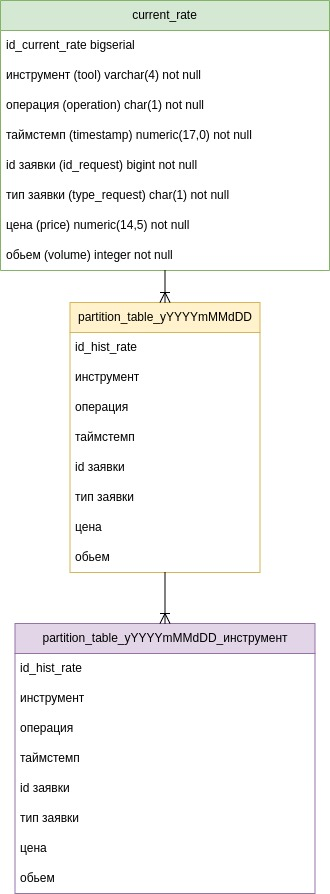
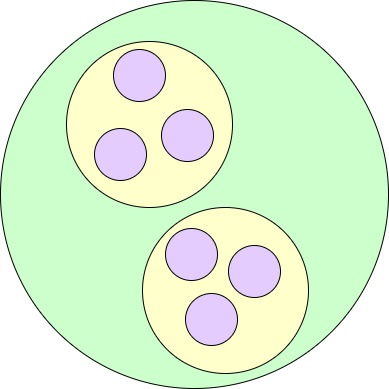
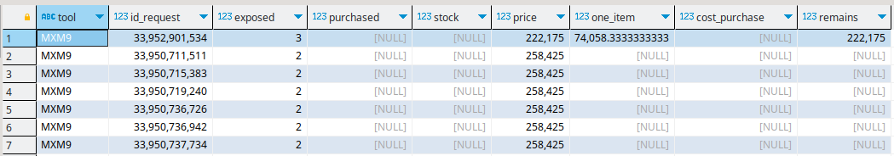

# Задание
1. Предложите схему БД для хранения таких данных. Основная функция БД – быстрое
получение информации об активных заявках.
2. Напишите SQL-запрос для получения информации об активной заявке с самой высокой
ценой покупки и активной заявке с самой низкой ценой продажи по заданному инструменту
на заданный момент времени.

# Описание модели данных
- инструмент (символ/код)
- операция (B-покупка, S-продажа)
- таймстемп
- id заявки
- тип заявки (1-выставление, 2-сделка, 0-снятие)
- цена
- объем

Пример лога:

        SiH1,B,20210201100207662,100,1,75951,50
        RIH1,S,20210201100207662,101,1,137100,4
        RIH1,S,20210201100207663,102,1,137100,3
        EuH1,B,20210201100207663,103,1,92186,30
        RIH1,B,20210201100207863,104,1,137105,10
        RIH1,S,20210201100207863,101,2,137100,4
        RIH1,B,20210201100207863,104,2,137105,4
        RIH1,S,20210201100207863,102,2,137100,3
        RIH1,B,20210201100207863,104,2,137105,3
        EuH1,B,20210201100307663,103,0,92186,30
        RIH1,B,20210201100447863,104,0,137105,3
        SiH1,S,20210201100537761,105,1,79500,100

# Описание предлагаемого решения
## Задание 1
Партиционированные таблицы выбраны т.к. 
1. Когда в выборке или изменении данных задействована большая
часть одной секции, последовательное сканирование этой секции
 может выполняться гораздо быстрее, чем случайный доступ по
 индексу к данным, разбросанным по всей таблице.
2. удаление партиций также полностью исключают
накладные расходы, связанные с выполнением VACUUM после DELETE.
3. Редко используемые данные можно перенести
на более дешёвые и медленные носители.

**НО следует иметь ввиду** 
1. Механизм автоматического создания соответствующих индексов во всех секциях отсутствует, поэтому индексы нужно добавлять в каждую секцию отдельно. Это также означает, что невозможно создать первичный ключ, ограничение уникальности или ограничение исключения, охватывающие все секции; такие ограничения возможны только в отдельных секциях.

2. Так как в секционированных таблицах первичные ключи не поддерживаются, на секционированные таблицы не могут ссылаться внешние ключи, так же как и внешние ключи в сторонних таблицах не могут ссылаться на какие-либо другие таблицы.

3. Триггеры уровня строк при необходимости должны определяться в отдельных секциях, а не в секционированной таблице.

4. Потребуется создавать партиции ежедневно. Для этого написан скрипт , который находится в файле **convert.ipynb**

        reate_ddl_partition_table(year, month, day) 

Так выглядит со стороны теории множеств

## Задание 2
Решение приложено в файле **sql_scripts/task.sql**

Результат выполнения sql скрипта

# Запуск решения
1. скачать данные с https://www.moex.com/ru/orders?orderlogs (см. Срочный рынок, Тип-А, файл _fut_ord.csv).
2. Запустить последовательно блоки кода из файла **convert.ipynb**
3. Изменить расположение расшаренной папки в docker-compose, на то, которое соответствует на Вашем хосте
   
   `` - /home/denis/Projects/BSPB_testovoe/:/etc/data ``
  
4. из директории проекта выполнить команду
   
           docker compose up

5. Выполнить скрипт загрузки данных из файла **sql_scripts/dml.sql**
6. Чтобы оптимизация партиций работала, то вывод команды
   
        show constraint_exclusion;

должен быть 

        partition

PostgreSQL будет пропускать партиции, которые не могут содержать совпадающие строки

